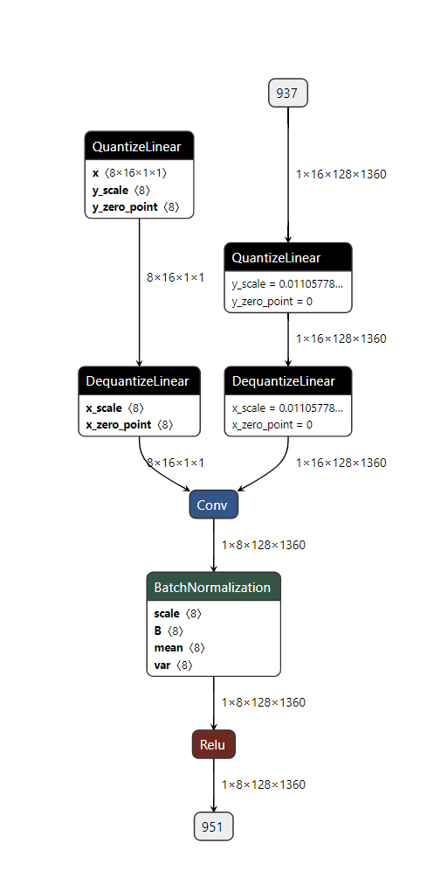
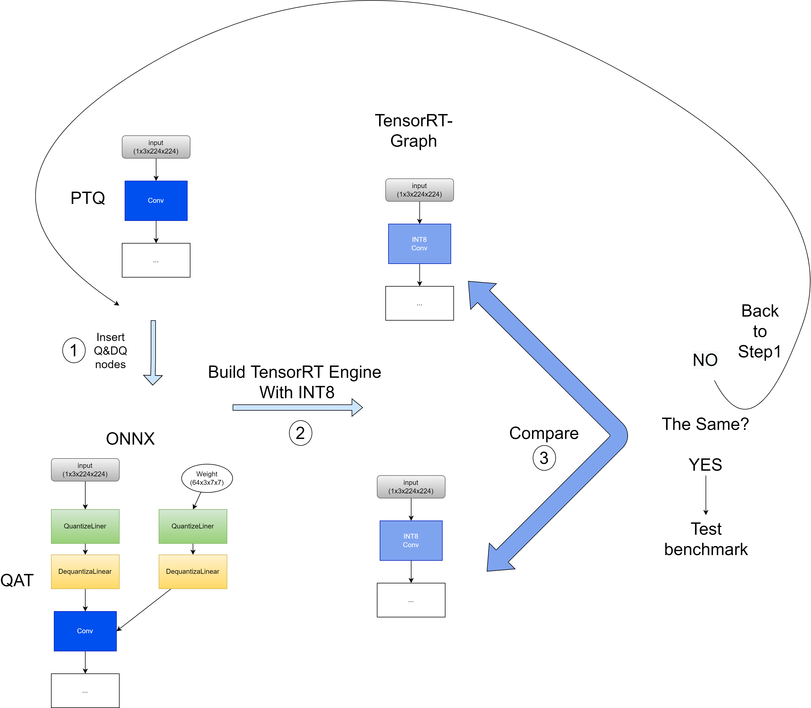
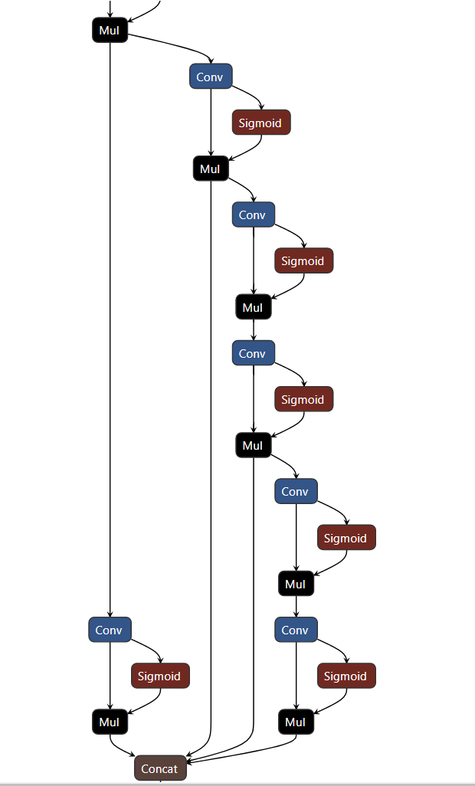
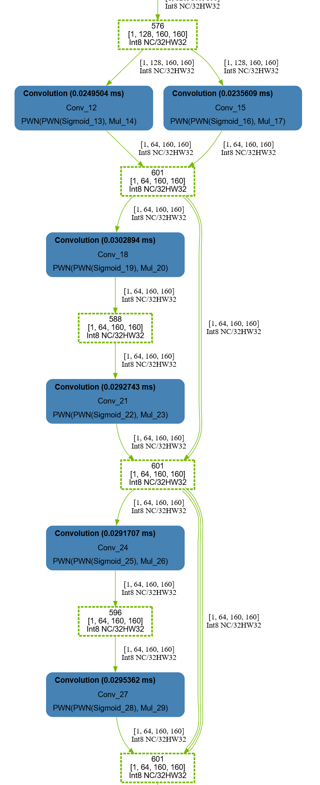
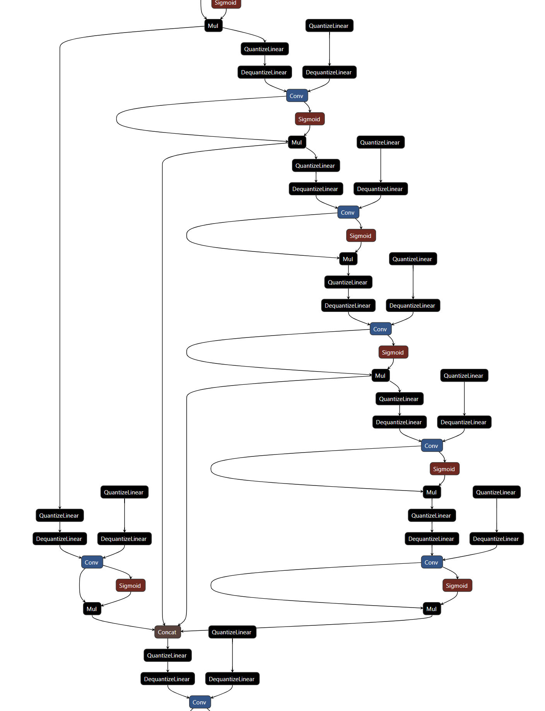
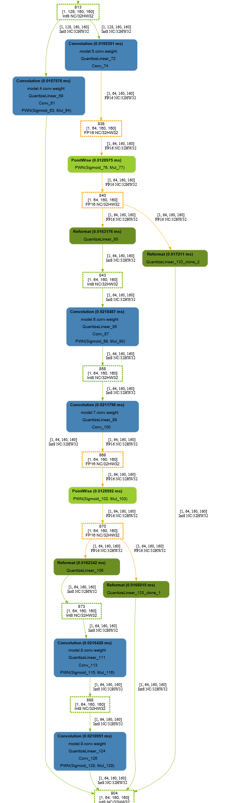
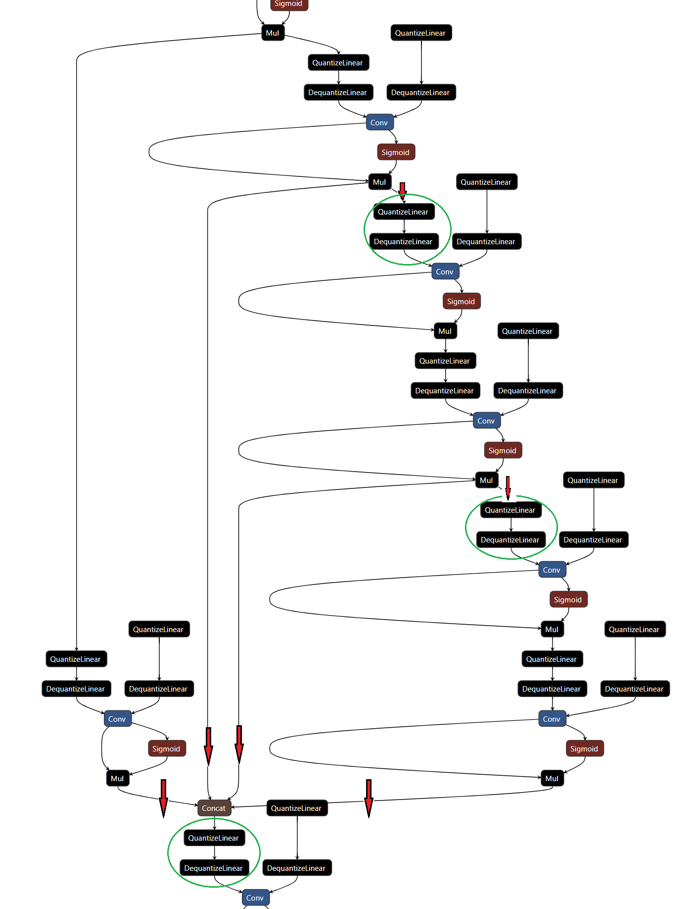
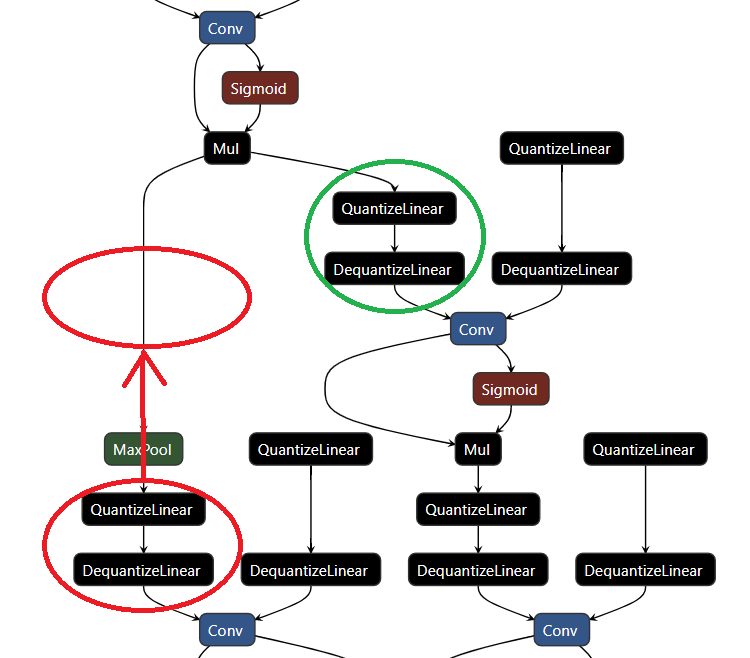

# Get QAT models' best performance on TensorRT

## 1. description
This guidance will teach you how to get the best performance QAT model on yolov7.

First, What is QAT:
> There are two forms of quantization: post-training quantization and quantization aware training. Start with post-training quantization since it's easier to use, though quantization aware training is often better for model accuracy.
Quantization aware training emulates inference-time quantization, creating a model that downstream tools will use to produce actually quantized models. The quantized models use lower-precision (e.g. 8-bit instead of 32-bit float), leading to benefits during deployment.

Another important question is to make sence what is the best performance of a QAT model on TensorRT. There are two workflows for creating quantized networks in TensorRT, one is Post-training quantization (PTQ). It derives scale factors after the network has been trained. TensorRT provides a workflow for PTQ, called calibration, where it measures the distribution of activations within each activation tensor as the network executes on representative input data, then uses that distribution to estimate a scale value for the tensor. The other way is QAT, In QAT, the scaling operations to transform between the quantized and unquantized values are represented explicitly by IQuantizeLayer (C++, Python) and IDequantizeLayer (C++, Python) nodes in the graph - these will henceforth be referred to as Q/DQ nodes(see pic as below). By contrast with implicit quantization, the explicit form specifies exactly where conversion to and from INT8 is performed, and the optimizer will perform only precision conversions that are dictated by the semantics of the model, even if adding extra conversions results in an engine that executes faster (for example, choosing an INT8 kernel implementation to execute a layer specified as having float precision or vice versa).



About the Q&DQ processing of TensorRT, please refer :[TensorRT-developer-guide: Processing of Q/DQ Networks](https://docs.nvidia.com/deeplearning/tensorrt/developer-guide/index.html#tensorrt-process-qdq)

So, The first thing we need to do is: make sure the all the computationally intensive layers should be run with int8 precision. And besides, TensorRT will make Layer-fusion for your model. If the model run in PTQ, TensorRT will merge the layers as most as it can to get the best performance on GPU. But in QAT, The finial excution graph will henceforth be referred to as Q/DQ nodes. That is, If you want to get the best performance of QAT, The Q&DQ nodes must can not break down the layer fusion of QAT model. One effective way is comparing the graph of QAT-TensorRT model with PTQ.

That is, If we want to get the best performance of QAT model, We should insert the Q&DQ model in the right place to suit the fusion-rules of TensorRT and avoid introducing useless precision conversions. 
If we can verbose the QAT-Graph and compare with the PTQ-Graph. And back to fineTune the Q&DQ nodes placement. The procedure can be summaried as below.
1. Insert QDQ in the model and export it to onnx
2. Convert PTQ-Onnx and QAT-onnx to TensorRT model and draw the TensorRT-model-graph
3. Compare the PTQ-TensorRT-Graph with QAT-TensorRT-Graph
4. If the QAT Graph is different from PTQ Graph. Back to Step 1. Else, to Step 5
5. Run PTQ benchmark and QAT benchmark to verify the TensorRT Performance



For the layer-fusion rules: We can reference to: [TensorRT-developer-guide: Types of Fusions](https://docs.nvidia.com/deeplearning/tensorrt/developer-guide/index.html#fusion-types)
For the tools for verbosing the TensorRT-model graph：[github-TensorRT: trt-engine-explorer](https://github.com/NVIDIA/TensorRT/tree/main/tools/experimental/trt-engine-explorer)


## 2. step by step guidance of Quantize a network

Now we will step by step optimizing a QAT model performance, We only care about the performance rather than accuracy at this time.
we use pytorch-quantization tool [pytorch-quantization](https://github.com/NVIDIA/TensorRT/blob/main/tools/pytorch-quantization) to quantize our pytorch model. And export onnx model with Q&DQ nodes.
This package provides a number of quantized layer modules, which contain quantizers for inputs and weights. e.g. `quant_nn.QuantLinear`, which can be used in place of `nn.Linear. ` These quantized layers can be substituted automatically, via monkey-patching, or by manually modifying the model definition.
Automatic layer substitution is done with quant_modules. This should be called before model creation.
ref: [pytorch-quantization-toolkit-tutorials](https://docs.nvidia.com/deeplearning/tensorrt/pytorch-quantization-toolkit/docs/tutorials/quant_resnet50.html#quantizing-resnet50)

### monkey-patch quantization

#### 1. prepare quantization model
with `quant_modules.initialize()` and `quant_modules.deactivate()`. The tool will automatic insert Q&DQ nodes in the network.

```python
quant_modules.initialize()
# Load PyTorch model
device = select_device(opt.device)
model = Model(opt.cfg, ch=3, nc=nc, anchors=hyp.get('anchors')).to(device)
labels = model.names
quant_modules.deactivate()
```
calibrate the onnx model to get the scale of Q&DQ nodes.
```python
# details ref : export_qat.py
def calibrate_model(model, model_name, data_loader, num_calib_batch, calibrator,hist_percentile, out_dir, device):
    """
        Feed data to the network and calibrate.
        Arguments:
            model: classification model
            model_name: name to use when creating state files
            data_loader: calibration data set
            num_calib_batch: amount of calibration passes to perform
            calibrator: type of calibration to use (max/histogram)
            hist_percentile: percentiles to be used for historgram calibration
            out_dir: dir to save state files in
    """
    if num_calib_batch > 0:
        print("Calibrating model")
        with torch.no_grad():
            collect_stats(model, data_loader, num_calib_batch, device)
        if not calibrator == "histogram":
            compute_amax(model, method="max")
            calib_output = os.path.join(
                out_dir,
                F"{model_name}-max-{num_calib_batch*data_loader.batch_size}.pth")
            ckpt = {'model': deepcopy(model)}
            torch.save(ckpt, calib_output)
        else:
            for percentile in hist_percentile:
                print(F"{percentile} percentile calibration")
                compute_amax(model, method="percentile")
                calib_output = os.path.join(
                    out_dir,
                    F"{model_name}-percentile-{percentile}-{num_calib_batch*data_loader.batch_size}.pth")
                ckpt = {'model': deepcopy(model)}
                torch.save(ckpt, calib_output)
            for method in ["mse", "entropy"]:
                print(F"{method} calibration")
                compute_amax(model, method=method)
                calib_output = os.path.join(
                    out_dir,
                    F"{model_name}-{method}-{num_calib_batch*data_loader.batch_size}.pth")
                ckpt = {'model': deepcopy(model)}
                torch.save(ckpt, calib_output)
```
export the calibrated-model to onnx
```python
quant_nn.TensorQuantizer.use_fb_fake_quant = True
torch.onnx.export(model, img, f, verbose=False, opset_version=13, input_names['images'],
                output_names=output_names,
                dynamic_axes=dynamic_axes)
quant_nn.TensorQuantizer.use_fb_fake_quant = False
```


#### 2. Run TensorRT benchmark and export layer information to json
we can export the TensorRT-engine-graph and profile information with flag `--exportLayerInfo=layer.json --profilingVerbosity=detailed --exportProfile=profile.json`.
first we export fp32 onnx model
```bash
$ python export.py --weights ./yolov7.pt --grid --simplify --topk-all 100 --iou-thres 0.65 --conf-thres 0.35 --img-size 640 640
```
Then we copy the onnx to target device, Here we use Jetson OrinX as our target device, TensorRT has different behavior on different GPU. So the test must run on your final target device
Run PTQ benchmark
```bash
$ /usr/src/tensorrt/bin/trtexec --onnx=yolov7.onnx --fp16 --int8 --verbose --saveEngine=yolov7_ptq.engine --workspace=1024000 --warmUp=500 --duration=10  --useCudaGraph --useSpinWait --noDataTransfers --exportLayerInfo=yolov7_ptq_layer.json --profilingVerbosity=detailed --exportProfile=yolov7_ptq_profile.json
```
Run fp16  benchmark
```bash
$ /usr/src/tensorrt/bin/trtexec --onnx=yolov7.onnx --fp16  --verbose --saveEngine=yolov7_fp16.engine --workspace=1024000 --warmUp=500 --duration=10  --useCudaGraph --useSpinWait --noDataTransfers --exportLayerInfo=yolov7_fp16_layer.json --profilingVerbosity=detailed --exportProfile=yolov7_fp16_profile.json
```
Run QAT benchmark
```bash
$ /usr/src/tensorrt/bin/trtexec --onnx=yolov7_qat.onnx --fp16 --int8 --verbose --saveEngine=yolov7_qat.engine --workspace=1024000 --warmUp=500 --duration=10  --useCudaGraph --useSpinWait --noDataTransfers --exportLayerInfo=yolov7_qat_layer.json --profilingVerbosity=detailed --exportProfile=yolov7_qat_profile.json
```

Run QAT_mask detect benchmark
```bash
$ /usr/src/tensorrt/bin/trtexec --onnx=yolov7_qat_maskdet.onnx --fp16 --int8 --verbose --saveEngine=yolov7_qat_maskdet.engine --workspace=1024000 --warmUp=500 --duration=10  --useCudaGraph --useSpinWait --noDataTransfers --exportLayerInfo=yolov7_qat_maskdet_layer.json --profilingVerbosity=detailed --exportProfile=yolov7_qat_maskdet_profile.json
```

We can see from the log:
The PTQ performance is :
```bash
[I] Throughput: 206.562 qps
```
The fp16 performance is :
```bash
[I] Throughput: 139.597 qps
```
The version 1 QAT performance is:
```bash
[I] Throughput: 180.439 qps
```

That is not a good performance as we expect, Let's look insight the reason

we use TensorRT opensource tool: [trt-engine-explorer](https://github.com/NVIDIA/TensorRT/tree/main/tools/experimental/trt-engine-explorer) 
Use the below code to draw the TensorRT-Engine-graph.(edit from `trt-engine-explorer/utils/draw_engine.py`)

```python
import graphviz
from trex import *
import argparse
import shutil


def draw_engine(engine_json_fname: str, engine_profile_fname: str):
    graphviz_is_installed =  shutil.which("dot") is not None
    if not graphviz_is_installed:
        print("graphviz is required but it is not installed.\n")
        print("To install on Ubuntu:")
        print("sudo apt --yes install graphviz")
        exit()

    plan = EnginePlan(engine_json_fname, engine_profile_fname)
    formatter = layer_type_formatter
    display_regions = True
    expand_layer_details = False

    graph = to_dot(plan, formatter,
                display_regions=display_regions,
                expand_layer_details=expand_layer_details)
    render_dot(graph, engine_json_fname, 'svg')


if __name__ == "__main__":
    parser = argparse.ArgumentParser()
    parser.add_argument('--layer', help="name of engine JSON file to draw")
    parser.add_argument('--profile', help="name of profile JSON file to draw")
    args = parser.parse_args()
    draw_engine(engine_json_fname=args.layer,engine_profile_fname=args.profile)
```
draw the graph:
```
$ python draw_engine.py --layer yolov7_qat_layer.json --profile yolov7_qat_profile.json
$ python draw_engine.py --layer yolov7_ptq_layer.json --profile yolov7_ptq_profile.json
```
we get `yolov7_qat_layer.json.svg` and `yolov7_ptq_layer.json.svg`

Let's see the difference:
 1. The convolution layers before first concat layer:
 the ori-onnx model looks like:

 
 And the tensorRT-graph of this part looks like:

  
 the qat-onnx model looks like:

 
 And the tensorRT-graph of this part looks like:

  
 There are a lot of useless int8->fp16 and fp16->int8 data convert in our QAT model. That is because : TensorRT will enforce the rules of QDQ to ensure consistent accuracy during inference and training(We didn't see any fp32 tensors here becasue TensorRT believes that fp16 will have the same accuracy as fp32)
 That is to say: If we want to reduce these useless data format convertion, We must edit our QDQ nodes to suit the fusion rules of TensorRT QAT.
 From the PTQ & QAT engine-graph, we can observed that: the concat layer will be reduced and all the input and output of concat will merge to one tensor(marked are red arrows in the below pic). If we do not guarantee the scale of Q&DQ nodes(marked with green circle in the below pic) of these tensors are the same. There will be redundant precision-conversion in our Graph.

   

For all the network-struct like this, We need do the same restrict. There is a special scene we need to take care: QDQ can cross some of the layers according to the commute rules from [TensorRT-developer-guide:tensorrt-process-qdq](https://docs.nvidia.com/deeplearning/tensorrt/developer-guide/index.html#tensorrt-process-qdq). eg. Max-pooling.
the DQ nodes marked with red circle will cross the MaxPool layer and TensorRT will remember the crossed-MaxPooling layer as int8 precision. Now we meet the similar scence as concat: We should restrict the scale of Q&DQ the same as the Q&DQ in the green circle to avoid generate  useless data format convertion here.

   

### optimized quantization
Now we apply all the restriction we have metioned. We can test the performance:

we still use trtexec to benchmark the onnx model:
```bash
$ /usr/src/tensorrt/bin/trtexec --onnx=yolov7_qat_maskdet.onnx --fp16 --int8 --verbose --saveEngine=yolov7_qat_optimized.engine --workspace=1024000 --warmUp=500 --duration=10  --useCudaGraph --useSpinWait --noDataTransfers --exportLayerInfo=yolov7_qat_optimized_layer.json --profilingVerbosity=detailed --exportProfile=yolov7_qat_optimized_profile.json
[I] Throughput: 207.267 qps
```
This performance is almost the same as PTQ performance.

Next we need to Finetune training our model to improve the accracy of the model.
